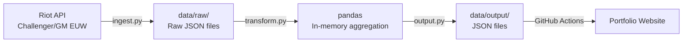

# LoL Meta Tracker

An end-to-end data engineering pipeline that ingests League of Legends ranked match data from the Riot API, transforms it into meta statistics, and delivers clean JSON files — refreshed weekly via GitHub Actions.

Built as a portfolio project to demonstrate the full data engineering lifecycle using **100% free tools**.

---

## Architecture



### Enterprise vs Portfolio

This project intentionally uses lightweight, free alternatives to production tools. The mapping is a key portfolio talking point:

| Enterprise tool | Portfolio equivalent | Why the swap works at this scale |
|---|---|---|
| Airflow / Prefect | GitHub Actions cron | Both are scheduled orchestrators; Actions handles daily runs fine |
| BigQuery / Snowflake | Python + pandas in memory | Data volume is a few MB — no warehouse needed |
| S3 / GCS data lake | `data/raw/` folder in repo | Git versions raw snapshots naturally |
| dbt | Python transformation scripts | dbt shines on SQL warehouses; Python is simpler here |
| Monitoring (Datadog) | GitHub Actions status + logs | Sufficient for a personal project |

See [`pipeline-enterprise/`](pipeline-enterprise/) for reference implementations showing what each of these tools would look like in a production environment.

---

## Pipeline Stages

1. **Ingest** (`pipeline/ingest.py`)
   - Fetches ~1000 Challenger/Grandmaster players via LEAGUE-EXP-V4
   - Resolves PUUIDs via SUMMONER-V4 (cached — PUUIDs never change)
   - Fetches last 5 ranked matches per player (deduped across players)
   - Saves raw JSON per match to `data/raw/{YYYY-MM-DD}/matches/`
   - Rate limited: 20 req/s, 100 req/2 min (personal key limits)

2. **Transform** (`pipeline/transform.py`)
   - Parses 10 participant rows per match
   - Filters remakes (< 900 s) and rows with missing roles
   - Aggregates by champion + role + patch: win rate, pick rate, avg KDA
   - Selects top 2 per role (minimum 10 games for statistical relevance)

3. **Output** (`pipeline/output.py`)
   - Writes `data/output/meta_summary.json`
   - Writes `data/output/top_champions.json`
   - Writes `data/output/champions_by_role.json`

4. **Orchestration** (`.github/workflows/weekly-refresh.yml`)
   - Runs weekly at 06:00 UTC every Monday
   - Commits updated output JSONs back to the repository

---

## Output Format

**`top_champions.json`** — consumed by the portfolio website:
```json
{
  "TOP": [
    {"champion": "Ambessa", "win_rate": 0.532, "pick_rate": 0.124, "games": 87, "avg_kda": 3.21},
    {"champion": "K'Sante", "win_rate": 0.518, "pick_rate": 0.087, "games": 61, "avg_kda": 2.94}
  ],
  "JUNGLE": [...],
  "MIDDLE": [...],
  "BOTTOM": [...],
  "UTILITY": [...]
}
```

---

## Quick Start

### Prerequisites
- Python 3.11+
- A Riot Games API key ([developer.riotgames.com](https://developer.riotgames.com))

> **Tip**: Apply for a *Personal Project* key — it doesn't expire daily. The process takes a few days.

### Setup

```bash
# Clone and install
git clone <repo-url>
cd lol-meta-tracker
pip install -r requirements.txt

# Configure API key
cp .env.example .env
# Edit .env and set RIOT_API_KEY=RGAPI-your-key-here

# Verify your key works
python scripts/test_api_key.py
```

### Running the Pipeline

```bash
# Full run (hits the Riot API, ~10-15 minutes)
python -m pipeline.main

# Dry run (uses cached raw data, no API calls)
python -m pipeline.main --dry-run
```

### Running Tests

```bash
pytest tests/ -v
# API connection test is automatically skipped if RIOT_API_KEY is not set
```

### GitHub Actions Setup

1. Push this repo to GitHub
2. Go to **Settings → Secrets and variables → Actions**
3. Add a secret named `RIOT_API_KEY` with your (non-expiring) personal project key
4. Trigger the first run manually: **Actions → Weekly Meta Refresh → Run workflow**

---

## Project Structure

```
lol-meta-tracker/
├── pipeline/               # The pipeline (runs in production)
│   ├── config.py           # Constants, endpoints, paths
│   ├── ingest.py           # Riot API fetching + rate limiting
│   ├── transform.py        # Data cleaning + aggregation
│   ├── output.py           # JSON file writers
│   └── main.py             # Orchestrator (--dry-run flag)
├── pipeline-enterprise/    # Reference: how this would look at production scale
│   ├── dbt/                # dbt models (staging + marts)
│   ├── airflow/            # Airflow DAG
│   └── docker-compose.yml  # Local Airflow + Postgres
├── data/
│   ├── raw/                # Raw API responses (gitignored)
│   └── output/             # Final JSONs (committed by CI)
├── tests/
│   ├── fixtures/           # Sample match JSON for unit tests
│   ├── test_transform.py   # 20 unit tests, no API needed
│   ├── test_ingest.py      # 13 mocked API tests
│   └── test_api_connection.py  # Live smoke test (skipped without key)
├── scripts/
│   └── test_api_key.py     # First-run API key verification
└── .github/workflows/
    ├── weekly-refresh.yml  # Cron job: runs weekly Mon at 06:00 UTC
    └── ci.yml              # PR validation: pytest + ruff + mypy
```

---

## Scope

- **Region**: EUW only
- **Tiers**: Challenger + Grandmaster (~1000 players)
- **Queue**: Ranked Solo/Duo (queueId 420)
- **Volume**: ~3000-5000 API calls per run, ~1500-3000 unique matches/day
- **Runtime**: 10-15 minutes (well within GitHub Actions 2000 min/month free tier)
